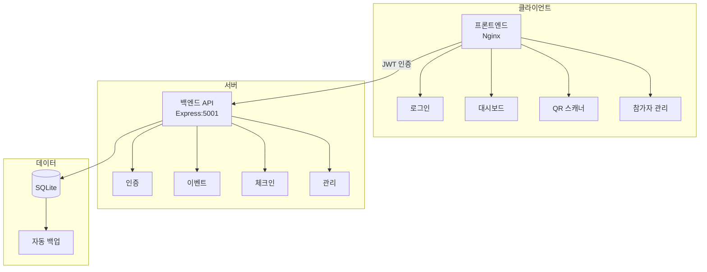

# QR 입장 관리 시스템

QR 코드 기반 멀티 이벤트 입장 관리 시스템 (v3.5.1)

## 🚀 빠른 시작

```bash
# 개발 환경 실행
./scripts/start-dev.sh

# 프로덕션 환경 실행
./scripts/start-prod.sh

# 로그 확인
docker-compose logs -f backend

# 시스템 중지
docker-compose down
```

**기본 접속 정보**
- 개발: http://localhost:8080 (프론트) / http://localhost:5001 (백엔드)
- 프로덕션: http://localhost (프론트) / http://localhost:5001 (백엔드)
- 관리자 비밀번호: `admin123` (환경변수 ADMIN_PASSWORD로 변경 가능)

## 📁 프로젝트 구조

```
qr-entrance-system/
├── backend/
│   ├── src/
│   │   ├── routes/        # API 라우트
│   │   ├── services/      # 비즈니스 로직
│   │   ├── config/        # 설정 파일
│   │   └── data/          # SQLite DB 및 백업
│   └── Dockerfile.dev     # 개발용 Docker 이미지
├── frontend/
│   ├── js/
│   │   ├── config/        # 앱 설정
│   │   ├── services/      # API 서비스
│   │   └── modules/       # 모듈화된 기능
│   ├── css/               # 스타일시트
│   └── *.html             # 페이지 파일
├── docker-compose.yml     # 프로덕션 설정
└── docker-compose.dev.yml # 개발 설정
```

## 🔧 핵심 기술 스택

- **백엔드**: Node.js 18 + Express + SQLite + JWT
- **프론트엔드**: Vanilla JS (ES6+) + html5-qrcode
- **인프라**: Docker Compose + Nginx
- **인증**: JWT (httpOnly 쿠키 + localStorage)

## 🏗️ 아키텍처

### 시스템 구조



### API 구조

모든 API 호출에는 `event_id` 파라미터가 필수입니다:

- `POST /api/auth/login` - 로그인 (event_id 불필요)
- `GET /api/events` - 이벤트 목록
- `GET /api/info?event_id=xxx` - 이벤트 정보
- `POST /api/checkin/verify?event_id=xxx` - QR 체크인
- `GET /api/admin/attendees?event_id=xxx` - 참가자 목록
- `GET /api/admin/stats?event_id=xxx` - 통계

## 💻 개발 가이드

### 환경 설정 (.env)

```env
# 인증
ADMIN_PASSWORD=admin123
JWT_SECRET=qr-entrance-secret-key-2025
PASSWORD_SALT=qr-entrance-salt-2025
TOKEN_EXPIRY=24h

# 백업
BACKUP_ENABLED=true
BACKUP_SCHEDULE=0 2 * * *
BACKUP_RETENTION=30

# 서버
PORT=5001
CORS_ORIGIN=*
```

### 주요 설정 파일

**frontend/js/config/app-config.js**
```javascript
window.AppConfig = {
    api: {
        baseUrl: window.location.port === '8080' 
            ? 'http://localhost:5001/api' 
            : '/api',
        timeout: 30000,
        retryCount: 3
    },
    scanner: {
        scanCooldown: 5000,  // 중복 스캔 방지 시간
        fps: 10
    }
};
```

### 데이터베이스 스키마

```sql
CREATE TABLE attendees (
  id INTEGER PRIMARY KEY AUTOINCREMENT,
  event_id TEXT NOT NULL,
  registration_number TEXT NOT NULL,
  name TEXT NOT NULL,
  company TEXT NOT NULL,
  contact TEXT,
  email TEXT NOT NULL,
  invitation_type TEXT,
  checked_in INTEGER DEFAULT 0,
  checkin_time TEXT,
  created_at TEXT DEFAULT (datetime('now', 'localtime')),
  updated_at TEXT DEFAULT (datetime('now', 'localtime')),
  UNIQUE(event_id, registration_number),
  UNIQUE(event_id, email)
);

CREATE INDEX idx_attendees_event_checkin ON attendees(event_id, checked_in);
CREATE INDEX idx_attendees_checkin_time ON attendees(checkin_time);
```

## 🛠️ 문제 해결

### 개발 환경 이슈

```bash
# 백엔드 연결 안 될 때
docker-compose -f docker-compose.dev.yml logs backend

# 포트 충돌 확인
lsof -i :5001
lsof -i :8080

# 컨테이너 재시작
docker-compose -f docker-compose.dev.yml restart backend
```

### 자주 발생하는 문제

1. **"이벤트를 찾을 수 없음"**
   - localStorage에서 selectedEventId 확인
   - API 호출 시 event_id 파라미터 확인

2. **로그인 안 됨**
   - 개발 환경에서 API URL 확인 (8080 → 5001)
   - CORS 설정 확인

3. **QR 스캔 느림**
   - 409 Conflict는 정상 (이미 체크인됨)
   - scanCooldown 조정 가능

## 📝 주요 기능

### 1. 멀티 이벤트 지원
- 하나의 시스템으로 여러 행사 동시 관리
- 이벤트별 독립적인 참가자 데이터
- 실시간 이벤트 전환

### 2. QR 코드 체크인
- JWT 기반 안전한 QR 코드
- 실시간 체크인 처리
- 중복 체크인 방지 (5초 쿨다운)
- 전체화면 스캐너 지원

### 3. 참가자 관리
- CSV 가져오기/내보내기
- 일괄 QR 코드 생성
- 실시간 검색 및 필터링
- 체크인 상태 토글

### 4. 자동 백업
- 매일 02:00 자동 백업
- 30일간 백업 보관
- gzip 압축 저장

## 🔐 보안

- JWT 기반 인증 (httpOnly 쿠키 + localStorage)
- 모든 API 엔드포인트 인증 필수
- QR 코드에 서명된 JWT 토큰 사용
- 환경변수로 민감한 정보 관리

## 📊 성능 최적화

- 409 Conflict 재시도 제거 (체크인 속도 개선)
- API 서비스 레이어 캐싱
- 인덱스 최적화로 쿼리 성능 향상
- 프론트엔드 번들 최적화

## 🚧 개발 중 주의사항

1. **Docker Compose 환경 필수** - 로컬 개발도 Docker로 실행
2. **event_id 파라미터** - 모든 API 호출에 필수
3. **인증 토큰** - 페이지 이동 시 토큰 확인
4. **CORS 설정** - 개발 환경에서 API URL 자동 감지

## 📌 버전 히스토리

### v3.5.1 (2025-07-24)
- ✅ 개발 환경 Docker 분리 (Dockerfile.dev)
- ✅ API 연결 자동 감지 (8080 → 5001)
- ✅ QR 스캔 성능 최적화
- ✅ DOM 안정성 개선
- ✅ 스캔 쿨다운 5초로 증가