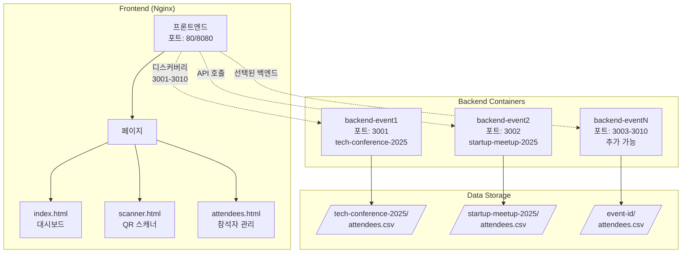
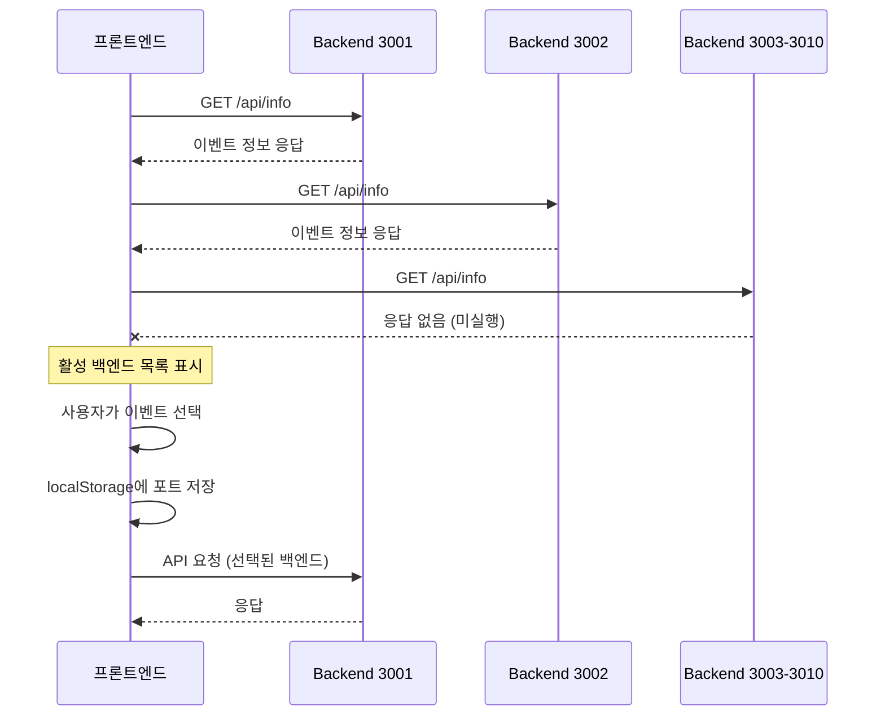

# CLAUDE.md

This file provides guidance to Claude Code (claude.ai/code) when working with code in this repository.

## 프로젝트 개요

QR 코드 기반 행사 입장 관리 시스템 (v2.1)
- **백엔드**: Node.js/Express, JWT 기반 QR 생성, CSV 데이터 저장
- **프론트엔드**: 바닐라 JavaScript, html5-qrcode 라이브러리
- **아키텍처**: Docker Compose 기반 멀티 이벤트 지원 (포트 3001-3010)

## 🚨 중요: 실행 환경 전제

**이 프로젝트는 항상 Docker Compose로 실행되어 있다고 가정합니다.**
- 프로덕션: `docker-compose.yml` (프론트엔드 80, 백엔드 3001-3010)
- 개발: `docker-compose.dev.yml` (프론트엔드 8080, 백엔드 3001-3002)

## 주요 개발 명령어

### Docker 기반 실행 (권장)
```bash
# 프로덕션 환경 시작
./scripts/start-prod.sh

# 개발 환경 시작 (nodemon + live-server)
./scripts/start-dev.sh

# 새 이벤트 추가
./scripts/add-event.sh
```

### 컨테이너 상태 확인 및 디버깅
```bash
# 실행 중인 컨테이너 확인
docker-compose ps

# 특정 백엔드 로그 확인
docker-compose logs -f backend-event1
docker-compose logs -f backend-event2

# 컨테이너 재시작
docker-compose restart backend-event1

# 전체 시스템 중지
docker-compose down

# 전체 시스템 재시작
docker-compose up -d
```

### 테스트 실행
```bash
# 전체 테스트 실행
npm test

# 특정 테스트 실행
npx playwright test tests/e2e/multi-event/backend-discovery.spec.js

# UI 모드 테스트
npx playwright test --ui

# Playwright 브라우저 설치 (최초 1회)
npx playwright install chromium
```

## 아키텍처 핵심 구조

### 시스템 아키텍처



### API 라우트 구조

```mermaid
graph LR
    subgraph "API Endpoints"
        Info[/api/info<br/>이벤트 정보]
        QR[/api/qr/generate<br/>QR 생성 - 미구현]
        Checkin[/api/checkin/verify<br/>체크인 검증]
        Admin[/api/admin/*<br/>관리자 기능]
        
        Admin --> AdminSub[참석자 목록<br/>통계 조회<br/>체크인 토글<br/>CSV 다운로드<br/>CSV 업로드]
    end
```

### 멀티 이벤트 동작 흐름



## 최근 개선사항 (2025-07-17)

### 구현 완료
- ✅ **QR 코드 생성 UI**: 모달 팝업, 다운로드 기능
- ✅ **체크인 토글**: 전역 함수 노출로 onclick 이벤트 해결
- ✅ **이벤트 전환**: 페이지별 차별화된 새로고침 전략
- ✅ **스캐너 초기화**: 백엔드 연결 완료 후 UI 활성화

### 테스트 현황
- **총 57개 중 36개 통과 (63.2%)**
- **주요 실패 원인**:
  1. QR 생성 API 미구현 (`/api/qr/generate`)
  2. 테스트 데이터 격리 문제 (CSV 공유)
  3. 이벤트 전환 동작 불일치
  4. 보안 테스트 응답 코드 차이 (401 vs 400)

## 주의사항

### 테스트 작성 시
- 헬퍼 함수 사용: `selectBackendAndLoadData(page, port, pageType)`
- 페이지 타입에 따른 네비게이션 처리 차이 고려
- QR 형식은 `CHECKIN:등록번호` 사용

### API 응답 구조
```javascript
// 성공 응답
{ success: true, attendeeInfo: { name, company, registrationNumber } }

// 409 에러 (중복 체크인)
{ error: "이미 체크인된 참석자입니다.", attendeeInfo: { ... } }

// 기타 에러
{ error: "에러 메시지" }
```

### 환경 설정
```env
JWT_SECRET=qr-entrance-secret-key-2025
EVENT_ID=이벤트ID
EVENT_NAME=이벤트명
CSV_FIELDS=등록번호,고객명,회사명,연락처,이메일,초대/현장방문,체크인,체크인시간
```

## 문제 해결 가이드

### 🐛 "백엔드에 연결할 수 없음" 에러 발생 시
```bash
# 1. 컨테이너 실행 상태 확인
docker-compose ps

# 2. 백엔드 로그 확인 (에러 메시지 확인)
docker-compose logs backend-event1
docker-compose logs backend-event2

# 3. 헬스체크 상태 확인
docker inspect qr-backend-event1 | grep -A 10 Health

# 4. 컨테이너 재시작
docker-compose restart backend-event1
```

### 🔄 데이터가 업데이트되지 않을 때
```bash
# 1. CSV 파일 위치 확인
ls -la backend/src/data/tech-conference-2025/
ls -la backend/src/data/startup-meetup-2025/

# 2. 컨테이너 내부 파일 확인
docker exec qr-backend-event1 ls -la /app/backend/src/data/tech-conference-2025/

# 3. 볼륨 마운트 상태 확인
docker inspect qr-backend-event1 | grep -A 20 Mounts
```

### 📡 포트 충돌 문제
```bash
# 사용 중인 포트 확인
lsof -i :3001
lsof -i :3002
lsof -i :80

# 또는
netstat -an | grep LISTEN | grep -E '3001|3002|80'
```

### 🔧 개발 중 코드 변경이 반영되지 않을 때
```bash
# 개발 환경인지 확인 (nodemon 사용 여부)
docker-compose -f docker-compose.dev.yml ps

# 컨테이너 로그에서 nodemon 재시작 확인
docker-compose -f docker-compose.dev.yml logs -f backend-event1-dev
```

## 향후 작업

1. **필수 구현**: QR 생성 API (`/api/qr/generate`)
2. **테스트 개선**: 데이터 격리, beforeEach 초기화
3. **보안 강화**: Rate limiting, 입력값 검증