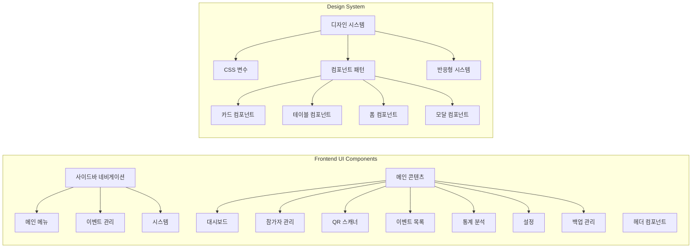
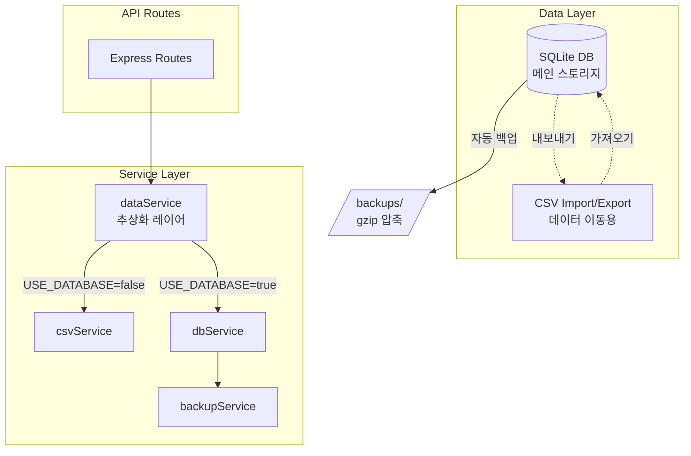

# CLAUDE.md

This file provides guidance to Claude Code (claude.ai/code) when working with code in this repository.

## 프로젝트 개요

QR 코드 기반 행사 입장 관리 시스템 (v3.1)
- **백엔드**: Node.js/Express, JWT 기반 QR 생성, SQLite 데이터베이스 전용
- **프론트엔드**: 바닐라 JavaScript, html5-qrcode 라이브러리
- **아키텍처**: 단일 백엔드 (포트 5001) + 이벤트별 데이터베이스 분리
- **데이터**: SQLite 전용 (CSV 레거시 코드 제거됨)

## 🚨 중요: 실행 환경 전제

**이 프로젝트는 항상 Docker Compose로 실행되어 있다고 가정합니다.**
- 프로덕션: `docker-compose.yml` (프론트엔드 80, 백엔드 5000)
- 개발: `docker-compose.dev.yml` (프론트엔드 8080, 백엔드 5000)

## 주요 개발 명령어

### Docker 기반 실행 (권장)
```bash
# 프로덕션 환경 시작
./scripts/start-prod.sh

# 개발 환경 시작 (nodemon + live-server)
./scripts/start-dev.sh
```

### 컨테이너 상태 확인 및 디버깅
```bash
# 실행 중인 컨테이너 확인
docker-compose ps

# 백엔드 로그 확인
docker-compose logs -f backend

# 컨테이너 재시작
docker-compose restart backend

# 전체 시스템 중지
docker-compose down

# 전체 시스템 재시작
docker-compose up -d
```

### 테스트 실행
```bash
# 전체 테스트 실행
npm test

# 특정 테스트 실행
npx playwright test tests/e2e/multi-event/event-switching.spec.js

# UI 모드 테스트
npx playwright test --ui

# Playwright 브라우저 설치 (최초 1회)
npx playwright install chromium
```

## 아키텍처 핵심 구조

### UI 아키텍처



### 시스템 아키텍처 (v3.0 - 단일 백엔드)

```mermaid
graph TB
    subgraph "Frontend (Nginx)"
        FE[프론트엔드<br/>포트: 80/8080]
        FE --> Pages[페이지]
        Pages --> Index[index.html<br/>대시보드]
        Pages --> Scanner[scanner.html<br/>QR 스캐너]
        Pages --> Attendees[attendees.html<br/>참석자 관리]
    end
    
    subgraph "Backend (단일 서비스)"
        BE[백엔드<br/>포트: 5000]
        BE --> API[API 엔드포인트]
        API --> Events[/api/events<br/>이벤트 목록]
        API --> Info[/api/info?event_id=xxx<br/>이벤트 정보]
        API --> Admin[/api/admin/*?event_id=xxx<br/>관리 기능]
    end
    
    subgraph "Data Storage"
        DB[(SQLite DB<br/>attendees.db)]
        DB --> E1[event_id: tech-conference-2025]
        DB --> E2[event_id: startup-meetup-2025]
        DB --> E3[event_id: ...]
    end
    
    FE -.->|API 호출| BE
    BE --> DB
```

### API 라우트 구조

```mermaid
graph LR
    subgraph "API Endpoints (event_id 파라미터 필수)"
        Events[/api/events<br/>모든 이벤트 목록]
        Info[/api/info?event_id=xxx<br/>이벤트 정보]
        QR[/api/qr/generate?event_id=xxx<br/>QR 생성]
        Checkin[/api/checkin/verify?event_id=xxx<br/>체크인 검증]
        Admin[/api/admin/*?event_id=xxx<br/>관리자 기능]
        
        Admin --> AdminSub[참석자 목록<br/>통계 조회<br/>체크인 토글<br/>CSV 다운로드<br/>CSV 업로드]
    end
```

### 이벤트 선택 동작 흐름


## 최근 변경사항 (2025-07-19 v3.1)

### 레거시 코드 완전 제거
- ✅ **CSV 서비스 제거**: csvService.js 파일 삭제, SQLite DB 전용
- ✅ **환경변수 정리**: USE_DATABASE, CSV_FIELDS, CSV_REQUIRED 제거
- ✅ **events 테이블 추가**: 이벤트 정보를 DB에서 관리
- ✅ **백업 파일 정리**: .bak 파일 및 레거시 데이터 디렉토리 삭제
- ✅ **하드코딩 제거**: eventNameMap을 DB 조회로 대체
- ✅ **테스트 환경 분리**: docker-compose.test.yml 추가

### 멀티포트 레거시 제거
- ✅ **단일 백엔드 아키텍처**: 포트 5001로 통합
- ✅ **이벤트 구분**: URL 파라미터 `event_id` 사용
- ✅ **백엔드 디스커버리 제거**: 포트 스캔 로직 제거
- ✅ **새 API**: `/api/events` - 모든 이벤트 목록 조회
- ✅ **Nginx 단순화**: `/api/*` 경로만 프록시
- ✅ **환경변수 간소화**: 포트별 설정 제거

### 이전 개선사항 (2025-07-19)

### UI/UX 전면 개편
- ✅ **모던 관리자 대시보드**: 현대적인 디자인 시스템 적용
- ✅ **전체 페이지 개편**: 일관된 디자인 언어 적용
- ✅ **디자인 요소**: 사용자 아바타, 상태 배지, 프로그레스 바
- ✅ **사용자 경험 개선**: 일관된 네비게이션, 활성 메뉴 표시

### 이전 개선사항 (2025-07-18)

### SQLite 데이터베이스 통합
- ✅ **CSV → SQLite 마이그레이션**: 데이터 신뢰성 대폭 향상
- ✅ **자동화된 백업 시스템**: 매일 새벽 2시 자동 백업
- ✅ **하이브리드 운영**: USE_DATABASE 환경변수로 CSV/DB 모드 전환
- ✅ **성능 최적화**: 대규모 데이터 처리 개선 (10만+ 참가자 지원)

## 주의사항

### API 호출 시
- 모든 API 호출에 `event_id` 쿼리 파라미터 필수
- 예: `/api/admin/attendees?event_id=tech-conference-2025`

### 환경 설정
```env
PORT=5001
JWT_SECRET=qr-entrance-secret-key-2025
BACKUP_ON_START=false
# USE_DATABASE 환경변수 제거됨 - 항상 SQLite 사용
```

## 문제 해결 가이드

### 🐛 "이벤트를 찾을 수 없음" 에러 발생 시
```bash
# 1. 컨테이너 실행 상태 확인
docker-compose ps

# 2. 백엔드 로그 확인
docker-compose logs backend

# 3. 데이터베이스 확인
docker exec qr-backend sqlite3 /app/backend/src/data/attendees.db "SELECT DISTINCT event_id FROM attendees;"
```

### 🔄 이벤트가 표시되지 않을 때
```bash
# 1. API 응답 확인
curl http://localhost:5000/api/events

# 2. 브라우저 캐시 삭제
# 3. localStorage 초기화
```

### 📡 API 연결 문제
```bash
# 포트 확인
lsof -i :5000

# 또는
netstat -an | grep LISTEN | grep 5000
```

## 데이터베이스 아키텍처



### 데이터베이스 스키마

```sql
-- attendees 테이블
CREATE TABLE attendees (
  id INTEGER PRIMARY KEY AUTOINCREMENT,
  event_id TEXT NOT NULL,
  registration_number TEXT NOT NULL,
  name TEXT NOT NULL,
  company TEXT NOT NULL,
  contact TEXT,
  email TEXT NOT NULL,
  invitation_type TEXT,
  checked_in INTEGER DEFAULT 0,
  checkin_time TEXT,
  created_at TEXT DEFAULT (datetime('now', 'localtime')),
  updated_at TEXT DEFAULT (datetime('now', 'localtime')),
  UNIQUE(event_id, registration_number),
  UNIQUE(event_id, email)
);

-- 성능 최적화 인덱스
CREATE INDEX idx_attendees_event_checkin ON attendees(event_id, checked_in);
CREATE INDEX idx_attendees_checkin_time ON attendees(checkin_time);
```

## 마이그레이션 및 운영 가이드

### 마이그레이션 실행
```bash
# 상태 확인
npm run migrate:status

# 마이그레이션 실행
npm run migrate
```

### 데이터베이스 전용 모드
- SQLite 데이터베이스만 사용 (CSV 저장소 제거됨)
- CSV는 가져오기/내보내기 기능으로만 지원

### 백업 관리
- 자동: 매일 02:00 KST
- 수동: POST /api/admin/backup?event_id=xxx
- 위치: backend/src/data/backups/
- 형식: attendees_backup_YYYYMMDD_HHMMSS.db.gz

## 최근 변경사항 (2025-01-20 추가)

### QR 코드 생성 및 참가자 관리 오류 수정
- ✅ **API 경로 중복 문제 해결**
  - 문제: `/api/api/qr/generate/...` 형태로 경로 중복
  - 원인: `getApiUrl()` 함수가 이미 `/api` 포함하는데 호출 시에도 추가
  - 해결: `/api/qr/generate/` → `/qr/generate/`로 수정
  - 파일: `/frontend/js/attendees.js`

- ✅ **참가자 추가 모달 JavaScript 에러 수정**
  - createAddAttendeeForm: eventInfo.csvFields undefined 처리
  - closeAddAttendeeModal: null 체크 추가
  - HTML에 누락된 DOM 엘리먼트 추가 (bulkPreviewContent, bulkAddResult, csvPreviewContent)

- ✅ **UI/UX 개선**
  - 모달 스크롤 문제 해결: max-height: 70vh 및 overflow-y: auto 추가
  - 커스텀 스크롤바 스타일 적용

- ✅ **코드베이스 정리**
  - 백업 파일 삭제: `backend/src/migrations/migrate.js.bak`
  - 빈 디렉토리 삭제: `tests/fixtures/test-qr-codes/`
  - 중복 requirements 폴더 정리: `frontend/requirements/` 삭제

### E2E 테스트 마이그레이션
- ✅ **단일 백엔드 아키텍처로 전환**
  - 포트 번호(3001-3010) → event_id 파라미터 사용
  - Docker 헬스체크 포트 수정: 5000 → 5001
  - 모든 API 호출에 event_id 쿼리 파라미터 추가

- ✅ **테스트 데이터 생성 개선**
  - SQLite 직접 삽입 방식 구현
  - CSV 파싱 에러 처리 개선
  - 빈 필드 기본값 제공

- ✅ **테스트 초기화 스크립트 추가**
  - `npm run test:init-db`: 테스트 데이터베이스 초기화
  - events 테이블에 이벤트 정보 삽입
  - attendees 테이블에 테스트 참가자 데이터 삽입

## 최근 변경사항 (2025-07-19 추가)

### dbService 멀티 이벤트 지원 개선
- ✅ **eventId 파라미터 추가**: 모든 주요 메서드에 선택적 eventId 파라미터 추가
  - `readAttendees(eventId = null)`
  - `writeAttendees(attendees, eventId = null)`
  - `updateAttendee(registrationNumber, updates, eventId = null)`
  - `getAttendeeByRegistrationNumber(registrationNumber, eventId = null)`
  - `generateRegistrationNumber(eventId = null)`
  - `addAttendee(attendeeData, eventId = null)`
  - `deleteAttendee(registrationNumber, eventId = null)` - 새로 추가
  - `checkUniqueConstraints(attendeeData, eventId = null, excludeRegistrationNumber = null)` - 새로 추가
- ✅ **하위 호환성 유지**: 모든 메서드는 eventId가 제공되지 않으면 기본값(process.env.EVENT_ID)을 사용
- ✅ **새 메서드 추가**:
  - `deleteAttendee`: 특정 이벤트의 참석자 삭제
  - `checkUniqueConstraints`: 이메일 및 등록번호 중복 검사 (업데이트 시 현재 레코드 제외 가능)

### 참가자 관리 UI 버그 수정 (2025-07-19 추가)
- ✅ **HTML 구조 수정**: 누락된 DOM 엘리먼트 추가
  - `bulkPreviewContent`: 일괄 추가 미리보기 컨텐츠 영역
  - `bulkAddResult`: 일괄 추가 결과 표시 영역
  - `csvPreviewContent`: CSV 미리보기 컨텐츠 영역
- ✅ **JavaScript 안정성 개선**:
  - `closeAddAttendeeModal`: null 체크 추가로 엘리먼트 참조 에러 방지
  - `createAddAttendeeForm`: 
    - eventInfo.csvFields가 undefined인 경우 기본값 제공
    - fields가 배열이 아닌 경우 기본 폼 구조 사용
    - 에러 발생 시 기본 폼으로 폴백
- ✅ **필수 필드 처리**: 필드 정보가 없을 때 기본 필드 구조 사용 (고객명, 회사명, 연락처, 이메일, 초대/현장방문)

### API 경로 중복 문제 해결 (2025-07-19)
- ✅ **문제**: API 호출 시 `/api/api/` 경로 중복 발생
- ✅ **원인**: `getApiUrl()` 함수가 이미 `/api` 접두사를 추가하는데, 호출 시에도 `/api`를 포함
- ✅ **해결**:
  - `attendees.js`의 `generateQRCode()`: `/api/qr/generate/...` → `/qr/generate/...`
  - `attendees.js`의 `bulkDownloadQR()`: `${api.baseUrl}/admin/qr/download-zip` → `getApiUrl('/admin/qr/download-zip')`
  - 불필요한 `Authorization` 헤더 제거 (JWT 인증 미사용)
- ✅ **환경변수 정리**: `USE_DATABASE` 변수 참조 제거 (항상 SQLite 사용)

### 백업 시스템 구현 (2025-07-20)
- ✅ **백업 관리 페이지 완성**: 백업 생성, 목록 조회, 다운로드, 복원, 삭제 기능
- ✅ **백업 API 엔드포인트**:
  - GET `/api/admin/backups?event_id=xxx` - 백업 목록 조회
  - POST `/api/admin/backup?event_id=xxx` - 백업 생성
  - GET `/api/admin/backup/download/:filename` - 백업 다운로드
  - POST `/api/admin/backup/restore/:filename?event_id=xxx` - 백업 복원
  - DELETE `/api/admin/backup/:filename` - 백업 삭제
- ✅ **의존성 정리**:
  - `sqlite3`와 `better-sqlite3`를 production dependencies로 이동
  - `"type": "module"` 제거로 CommonJS 호환성 유지
- ✅ **백업 서비스 자동 시작**: 매일 새벽 2시 자동 백업

# important-instruction-reminders
Do what has been asked; nothing more, nothing less.
NEVER create files unless they're absolutely necessary for achieving your goal.
ALWAYS prefer editing an existing file to creating a new one.
NEVER proactively create documentation files (*.md) or README files. Only create documentation files if explicitly requested by the User.