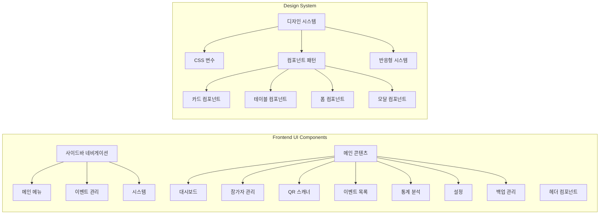
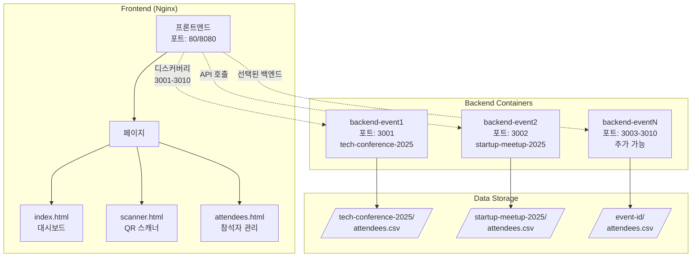
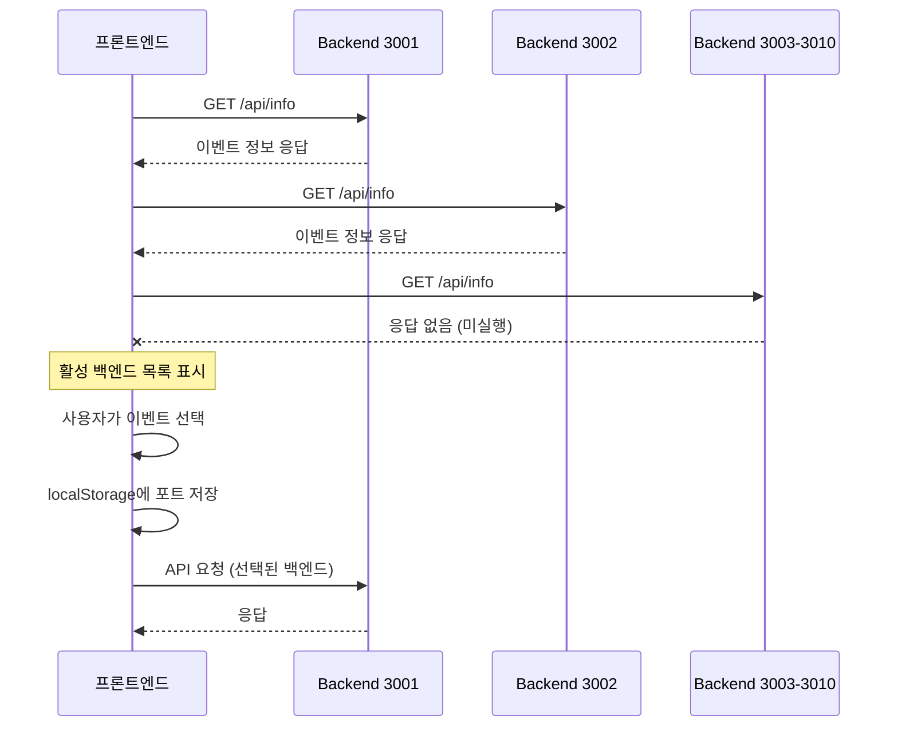
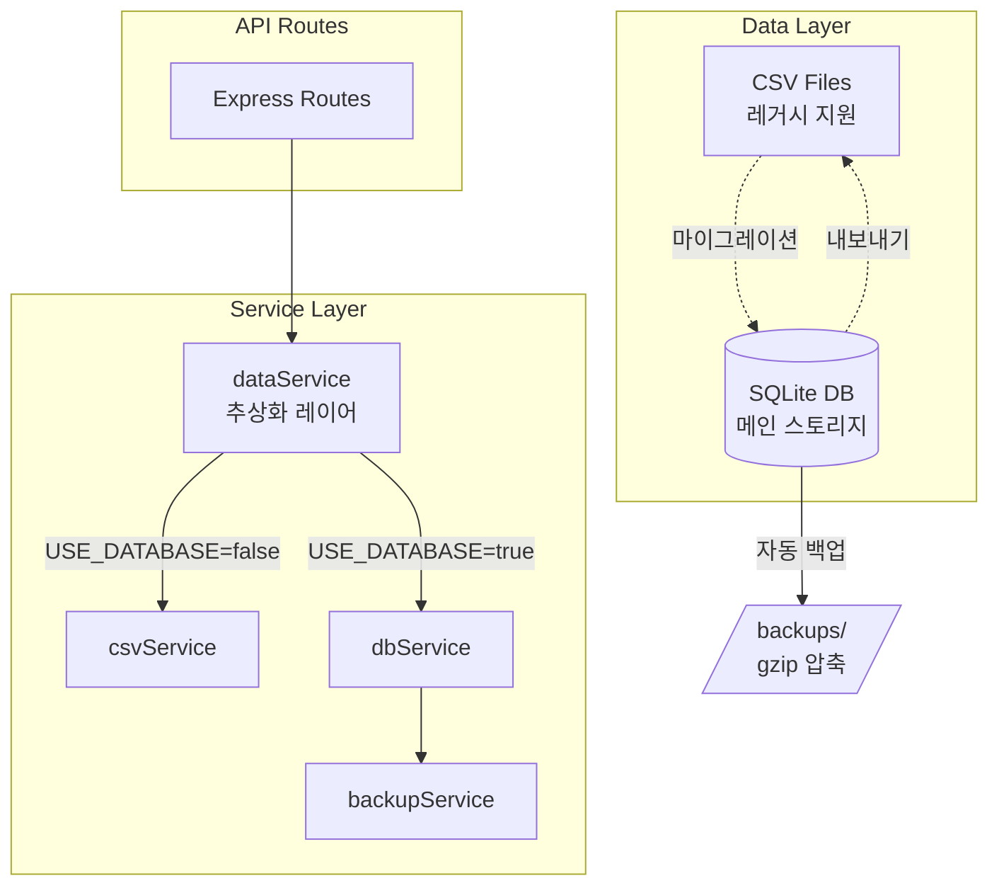

# CLAUDE.md

This file provides guidance to Claude Code (claude.ai/code) when working with code in this repository.

## 프로젝트 개요

QR 코드 기반 행사 입장 관리 시스템 (v2.1)
- **백엔드**: Node.js/Express, JWT 기반 QR 생성, CSV 데이터 저장
- **프론트엔드**: 바닐라 JavaScript, html5-qrcode 라이브러리
- **아키텍처**: Docker Compose 기반 멀티 이벤트 지원 (포트 3001-3010)

## 🚨 중요: 실행 환경 전제

**이 프로젝트는 항상 Docker Compose로 실행되어 있다고 가정합니다.**
- 프로덕션: `docker-compose.yml` (프론트엔드 80, 백엔드 3001-3010)
- 개발: `docker-compose.dev.yml` (프론트엔드 8080, 백엔드 3001-3002)

## 주요 개발 명령어

### Docker 기반 실행 (권장)
```bash
# 프로덕션 환경 시작
./scripts/start-prod.sh

# 개발 환경 시작 (nodemon + live-server)
./scripts/start-dev.sh

# 새 이벤트 추가
./scripts/add-event.sh
```

### 컨테이너 상태 확인 및 디버깅
```bash
# 실행 중인 컨테이너 확인
docker-compose ps

# 특정 백엔드 로그 확인
docker-compose logs -f backend-event1
docker-compose logs -f backend-event2

# 컨테이너 재시작
docker-compose restart backend-event1

# 전체 시스템 중지
docker-compose down

# 전체 시스템 재시작
docker-compose up -d
```

### 테스트 실행
```bash
# 전체 테스트 실행
npm test

# 특정 테스트 실행
npx playwright test tests/e2e/multi-event/backend-discovery.spec.js

# UI 모드 테스트
npx playwright test --ui

# Playwright 브라우저 설치 (최초 1회)
npx playwright install chromium
```

## 아키텍처 핵심 구조

### UI 아키텍처



### 시스템 아키텍처



### API 라우트 구조

```mermaid
graph LR
    subgraph "API Endpoints"
        Info[/api/info<br/>이벤트 정보]
        QR[/api/qr/generate<br/>QR 생성 - 미구현]
        Checkin[/api/checkin/verify<br/>체크인 검증]
        Admin[/api/admin/*<br/>관리자 기능]
        
        Admin --> AdminSub[참석자 목록<br/>통계 조회<br/>체크인 토글<br/>CSV 다운로드<br/>CSV 업로드]
    end
```

### 멀티 이벤트 동작 흐름



## 최근 개선사항 (2025-07-19)

### UI/UX 전면 개편
- ✅ **모던 관리자 대시보드**: 현대적인 디자인 시스템 적용
  - 사이드바 네비게이션 구현 (3개 섹션 구조)
  - CSS 변수 기반 테마 시스템
  - 반응형 그리드 레이아웃
  - 애니메이션 효과 및 호버 상태
- ✅ **전체 페이지 개편**: 일관된 디자인 언어 적용
  - 대시보드: 통계 카드, QR 스캐너, 빠른 작업
  - 참가자 관리: 아바타 기반 테이블, 일괄 작업
  - QR 스캐너: 스캔 결과 카드, 실시간 통계
  - 이벤트 목록: 그리드 카드 레이아웃
  - 통계 분석: Chart.js 기반 시각화
  - 설정: 카테고리별 그룹화
  - 백업 관리: 상태 카드, 작업 액션
- ✅ **디자인 요소**: 
  - 사용자 아바타 (이름 첫글자)
  - 상태 배지 및 라벨
  - 프로그레스 바
  - 스위치 토글
  - 모달 다이얼로그
- ✅ **사용자 경험 개선**:
  - 모든 페이지 간 일관된 네비게이션
  - 활성 메뉴 상태 표시
  - 빈 상태 디자인
  - 로딩 및 에러 상태 처리

## 이전 개선사항 (2025-07-18)

### SQLite 데이터베이스 통합
- ✅ **CSV → SQLite 마이그레이션**: 데이터 신뢰성 대폭 향상
  - sqlite3 라이브러리 사용 (비동기 API)
  - WAL 모드로 동시성 처리 개선
  - 트랜잭션 지원으로 데이터 무결성 보장
  - 기존 CSV 데이터 성공적으로 마이그레이션 (18명)
- ✅ **자동화된 백업 시스템**: 매일 새벽 2시 자동 백업
  - gzip 압축으로 저장 공간 절약
  - 30일 보관 정책
  - 수동 백업 API 제공
- ✅ **하이브리드 운영**: USE_DATABASE 환경변수로 CSV/DB 모드 전환
  - 기존 CSV 시스템과 100% 호환
  - CSV 가져오기/내보내기 유지
  - 언제든 롤백 가능
- ✅ **성능 최적화**:
  - 인덱스 자동 생성 (event_id, checkin 최적화)
  - 대규모 데이터 처리 개선 (10만+ 참가자 지원)
  - 빠른 검색 및 필터링

### 테스트 커버리지
- ✅ **단위 테스트**: dbService, backupService, migration 테스트
- ✅ **통합 테스트**: API 엔드포인트 전체 커버리지
- ✅ **마이그레이션 테스트**: CSV → DB 변환 검증

### 기술적 변경사항
- **better-sqlite3 → sqlite3 마이그레이션**: macOS 컴파일 오류 해결
- **비동기 패턴 적용**: 모든 DB 작업을 Promise 기반으로 변환
- **전역 백업 서비스**: global.backupService로 접근

### 일괄 작업 기능 추가
- ✅ **다중 선택**: 체크박스로 여러 참가자 선택 가능
- ✅ **일괄 삭제**: 선택된 참가자들을 한 번에 삭제
- ✅ **일괄 체크인**: 선택된 참가자들의 체크인 상태 일괄 변경
- ✅ **QR 일괄 다운로드**: 선택된 참가자들의 QR 코드를 ZIP 파일로 다운로드
  - 파일명 형식: `등록번호_이름.png`
  - ZIP 파일명: `qr_codes_YYYY-MM-DD_HH-MM-SS.zip`

## 이전 개선사항 (2025-07-17)

### 구현 완료
- ✅ **QR 코드 생성 API**: `/api/qr/generate/:registrationNumber` 엔드포인트 구현 완료
- ✅ **QR 코드 생성 UI**: 모달 팝업, 다운로드 기능
- ✅ **체크인 토글**: 전역 함수 노출로 onclick 이벤트 해결
- ✅ **이벤트 전환**: 페이지별 차별화된 새로고침 전략
- ✅ **스캐너 초기화**: 백엔드 연결 완료 후 UI 활성화

### 테스트 현황
- **총 57개 중 36개 통과 (63.2%)**
- **주요 실패 원인**:
  1. 테스트 데이터 격리 문제 (CSV 공유)
  2. 이벤트 전환 동작 불일치
  3. 보안 테스트 응답 코드 차이 (401 vs 400)
  4. Frontend 컨테이너 health check 실패

### 알려진 이슈
- **Frontend 컨테이너 unhealthy 상태**: Nginx health check 실패
- **백엔드 자동 선택 실패**: frontend/js 파일 로딩 순서 문제로 간헐적 실패
- **테스트 데이터 격리**: 여러 테스트가 동일한 CSV 파일 공유로 상호 간섭

## 주의사항

### 테스트 작성 시
- 헬퍼 함수 사용: `selectBackendAndLoadData(page, port, pageType)`
- 페이지 타입에 따른 네비게이션 처리 차이 고려
- QR 형식은 `CHECKIN:등록번호` 사용

### API 응답 구조
```javascript
// 성공 응답
{ success: true, attendeeInfo: { name, company, registrationNumber } }

// 409 에러 (중복 체크인)
{ error: "이미 체크인된 참석자입니다.", attendeeInfo: { ... } }

// 기타 에러
{ error: "에러 메시지" }
```

### 환경 설정
```env
JWT_SECRET=qr-entrance-secret-key-2025
EVENT_ID=이벤트ID
EVENT_NAME=이벤트명
CSV_FIELDS=등록번호,고객명,회사명,연락처,이메일,초대/현장방문,체크인,체크인시간
USE_DATABASE=true  # true: SQLite 모드 (권장), false: CSV 모드
```

## 문제 해결 가이드

### 🐛 "백엔드에 연결할 수 없음" 에러 발생 시
```bash
# 1. 컨테이너 실행 상태 확인
docker-compose ps

# 2. 백엔드 로그 확인 (에러 메시지 확인)
docker-compose logs backend-event1
docker-compose logs backend-event2

# 3. 헬스체크 상태 확인
docker inspect qr-backend-event1 | grep -A 10 Health

# 4. 컨테이너 재시작
docker-compose restart backend-event1
```

### 🔄 데이터가 업데이트되지 않을 때
```bash
# 1. CSV 파일 위치 확인
ls -la backend/src/data/tech-conference-2025/
ls -la backend/src/data/startup-meetup-2025/

# 2. 컨테이너 내부 파일 확인
docker exec qr-backend-event1 ls -la /app/backend/src/data/tech-conference-2025/

# 3. 볼륨 마운트 상태 확인
docker inspect qr-backend-event1 | grep -A 20 Mounts
```

### 📡 포트 충돌 문제
```bash
# 사용 중인 포트 확인
lsof -i :3001
lsof -i :3002
lsof -i :80

# 또는
netstat -an | grep LISTEN | grep -E '3001|3002|80'
```

### 🔧 개발 중 코드 변경이 반영되지 않을 때
```bash
# 개발 환경인지 확인 (nodemon 사용 여부)
docker-compose -f docker-compose.dev.yml ps

# 컨테이너 로그에서 nodemon 재시작 확인
docker-compose -f docker-compose.dev.yml logs -f backend-event1-dev
```

## 향후 작업

1. **테스트 개선**: 데이터 격리, beforeEach 초기화
2. **보안 강화**: Rate limiting, 입력값 검증
3. **Frontend health check 수정**: Nginx 설정 개선
4. **백엔드 디스커버리 안정화**: JS 로딩 순서 보장

## 데이터베이스 아키텍처



### 데이터베이스 스키마

```sql
-- attendees 테이블
CREATE TABLE attendees (
  id INTEGER PRIMARY KEY AUTOINCREMENT,
  event_id TEXT NOT NULL,
  registration_number TEXT NOT NULL,
  name TEXT NOT NULL,
  company TEXT NOT NULL,
  contact TEXT,
  email TEXT NOT NULL,
  invitation_type TEXT,
  checked_in INTEGER DEFAULT 0,
  checkin_time TEXT,
  created_at TEXT DEFAULT (datetime('now', 'localtime')),
  updated_at TEXT DEFAULT (datetime('now', 'localtime')),
  UNIQUE(event_id, registration_number),
  UNIQUE(event_id, email)
);

-- 성능 최적화 인덱스
CREATE INDEX idx_attendees_event_checkin ON attendees(event_id, checked_in);
CREATE INDEX idx_attendees_checkin_time ON attendees(checkin_time);
```

## 마이그레이션 및 운영 가이드

### 마이그레이션 실행
```bash
# 상태 확인
npm run migrate:status

# 마이그레이션 실행
npm run migrate
```

### 모드 전환
```bash
# 데이터베이스 모드 (기본값)
USE_DATABASE=true

# CSV 모드 (레거시)
USE_DATABASE=false
```

### 백업 관리
- 자동: 매일 02:00 KST
- 수동: POST /api/admin/backup
- 위치: backend/src/data/backups/
- 형식: attendees_backup_YYYYMMDD_HHMMSS.db.gz

## 🚀 개선 계획 (2025-07-17 최종)

### 개요
기존 CSV 파일 시스템을 유지하면서 실용적인 기능 개선

### 주요 개선사항

#### 1. 온라인 참가자 등록
- **등록 페이지**: 참가자가 직접 정보 입력
- **자동 CSV 추가**: 실시간으로 attendees.csv 업데이트
- **즉시 QR 제공**: 등록 완료 시 QR 코드 표시/다운로드

#### 2. 일괄 작업 기능
- **QR 일괄 생성**: 전체 참가자 QR을 ZIP으로 다운로드
- **이메일 추출**: 체크인 상태별 이메일 목록 복사
- **현장 등록**: 관리자 페이지에서 즉석 추가

#### 3. 외부 연동 (선택적)
- **Webhook API**: 노션/구글폼 등 외부 서비스 연동
- **표준 응답**: QR 데이터 포함 JSON 응답

### 구현 계획
```
Phase 1 (3일): 온라인 등록 기능
Phase 2 (2일): 일괄 작업 도구
Phase 3 (2일): 외부 연동 API
```

### 장점
- **간단함**: 기존 CSV 구조 유지
- **빠른 구현**: 1주일 내 완성
- **비용 없음**: 추가 서비스 불필요

### 참고 문서
- 최종 요구사항: `requirements/2025-07-17-1500-event-workflow-improvement/11-requirements-spec-final.md`