# CLAUDE.md

This file provides guidance to Claude Code (claude.ai/code) when working with code in this repository.

## 프로젝트 개요

QR 코드 기반 행사 입장 관리 시스템 (v3.3)
- **백엔드**: Node.js/Express, JWT 기반 QR 생성, SQLite 데이터베이스 전용
- **프론트엔드**: 바닐라 JavaScript, html5-qrcode 라이브러리
- **아키텍처**: 단일 백엔드 (포트 5001) + 이벤트별 데이터베이스 분리
- **데이터**: SQLite 전용

## 🚨 중요: 실행 환경 전제

**이 프로젝트는 항상 Docker Compose로 실행되어 있다고 가정합니다.**
- 프로덕션: `docker-compose.yml` (프론트엔드 80, 백엔드 5001)
- 개발: `docker-compose.dev.yml` (프론트엔드 8080, 백엔드 5001)

## 주요 개발 명령어

### Docker 기반 실행 (권장)
```bash
# 프로덕션 환경 시작
./scripts/start-prod.sh

# 개발 환경 시작 (nodemon + live-server)
./scripts/start-dev.sh
```

### 컨테이너 상태 확인 및 디버깅
```bash
# 실행 중인 컨테이너 확인
docker-compose ps

# 백엔드 로그 확인
docker-compose logs -f backend

# 컨테이너 재시작
docker-compose restart backend

# 전체 시스템 중지
docker-compose down

# 전체 시스템 재시작
docker-compose up -d
```

### 테스트 실행
```bash
# 전체 테스트 실행
npm test

# 특정 테스트 실행
npx playwright test tests/e2e/multi-event/event-switching.spec.js

# UI 모드 테스트
npx playwright test --ui

# Playwright 브라우저 설치 (최초 1회)
npx playwright install chromium
```

## 아키텍처 핵심 구조

### UI 아키텍처

```mermaid
graph LR
    subgraph "Frontend UI Components"
        SB[사이드바 네비게이션]
        HD[헤더 컴포넌트]
        MC[메인 콘텐츠]
        
        SB --> M1[메인 메뉴]
        SB --> M2[이벤트 관리]
        SB --> M3[시스템]
        
        MC --> P1[대시보드]
        MC --> P2[참가자 관리]
        MC --> P3[QR 스캐너]
        MC --> P4[이벤트 목록]
        MC --> P5[통계 분석]
        MC --> P6[설정]
        MC --> P7[백업 관리]
    end
    
    subgraph "Design System"
        DS[디자인 시스템]
        DS --> CV[CSS 변수]
        DS --> CP[컴포넌트 패턴]
        DS --> RS[반응형 시스템]
        
        CP --> Cards[카드 컴포넌트]
        CP --> Tables[테이블 컴포넌트]
        CP --> Forms[폼 컴포넌트]
        CP --> Modals[모달 컴포넌트]
    end
```



### 시스템 아키텍처 (v3.0 - 단일 백엔드)

```mermaid
graph TB
    subgraph "Frontend (Nginx)"
        FE[프론트엔드<br/>포트: 80/8080]
        FE --> Pages[페이지]
        Pages --> Index[index.html<br/>대시보드]
        Pages --> Scanner[scanner.html<br/>QR 스캐너]
        Pages --> Attendees[attendees.html<br/>참석자 관리]
    end
    
    subgraph "Backend (단일 서비스)"
        BE[백엔드<br/>포트: 5001]
        BE --> API[API 엔드포인트]
        API --> Events[/api/events<br/>이벤트 목록]
        API --> Info[/api/info?event_id=xxx<br/>이벤트 정보]
        API --> Admin[/api/admin/*?event_id=xxx<br/>관리 기능]
    end
    
    subgraph "Data Storage"
        DB[(SQLite DB<br/>attendees.db)]
        DB --> E1[event_id: tech-conference-2025]
        DB --> E2[event_id: startup-meetup-2025]
        DB --> E3[event_id: ...]
    end
    
    FE -.->|API 호출| BE
    BE --> DB
```

### API 라우트 구조

```mermaid
graph LR
    subgraph "API Endpoints (event_id 파라미터 필수)"
        Events[/api/events<br/>모든 이벤트 목록]
        Info[/api/info?event_id=xxx<br/>이벤트 정보]
        QR[/api/qr/generate?event_id=xxx<br/>QR 생성]
        Checkin[/api/checkin/verify?event_id=xxx<br/>체크인 검증]
        Admin[/api/admin/*?event_id=xxx<br/>관리자 기능]
        
        Admin --> AdminSub[참석자 목록<br/>통계 조회<br/>체크인 토글<br/>CSV 다운로드<br/>CSV 업로드]
    end
```

### 이벤트 선택 동작 흐름


## 최근 변경사항 (2025-07-22 v3.3)

### 코드 리팩토링 및 모듈화
- ✅ **설정 파일 분리**: `js/config/app-config.js`로 모든 설정값 중앙화
- ✅ **API 서비스 강화**: `js/services/api-service.js` - 재시도 로직, 로딩 상태 관리, 에러 핸들링 개선
- ✅ **스캐너 모듈화**: `js/modules/scanner-core.js`로 핵심 기능 분리 (기존 인터페이스 유지)
- ✅ **UI 개선**: 카메라 거리 가이드 추가 (30-50cm 권장)
- ✅ **전체화면 스캔 영역 확대**: 화면의 90% 활용 (최대 800px)

### 2025-07-21 v3.2
- ✅ **전체화면 스캐너 문제 해결**: z-index 계층 구조 재정립
- ✅ **불필요한 코드 제거**: 레거시 CSV 관련 코드 완전 제거
- ✅ **updateRecentCheckins 오류 수정**: scanner.js에서 불필요한 함수 호출 제거
- ✅ **API 응답 처리 개선**: 체크인 중복 체크 로직 수정
- ✅ **디버깅 로그 추가**: 문제 해결을 위한 상세 로그


## 주의사항

### API 호출 시
- 모든 API 호출에 `event_id` 쿼리 파라미터 필수
- 예: `/api/admin/attendees?event_id=tech-conference-2025`

### 환경 설정
```env
PORT=5001
JWT_SECRET=qr-entrance-secret-key-2025
BACKUP_ON_START=false
# USE_DATABASE 환경변수 제거됨 - 항상 SQLite 사용
```

## 문제 해결 가이드

### 🐛 "이벤트를 찾을 수 없음" 에러 발생 시
```bash
# 1. 컨테이너 실행 상태 확인
docker-compose ps

# 2. 백엔드 로그 확인
docker-compose logs backend

# 3. 데이터베이스 확인
docker exec qr-backend sqlite3 /app/backend/src/data/attendees.db "SELECT DISTINCT event_id FROM attendees;"
```

### 🔄 이벤트가 표시되지 않을 때
```bash
# 1. API 응답 확인
curl http://localhost:5001/api/events

# 2. 브라우저 캐시 삭제
# 3. localStorage 초기화
```

### 📡 API 연결 문제
```bash
# 포트 확인
lsof -i :5001

# 또는
netstat -an | grep LISTEN | grep 5001
```

## 데이터베이스 아키텍처

```mermaid
graph TB
    subgraph "Data Layer"
        DB[(SQLite DB<br/>메인 스토리지)]
        CSV[CSV Import/Export<br/>데이터 이동용]
        
        CSV -.->|가져오기| DB
        DB -.->|내보내기| CSV
    end
    
    subgraph "Service Layer"
        DBS[dbService]
        BS[backupService]
        
        DBS --> BS
    end
    
    subgraph "API Routes"
        API[Express Routes]
        API --> DBS
    end
    
    DB -->|자동 백업| BK[/backups/<br/>gzip 압축/]
```



### 데이터베이스 스키마

```sql
-- attendees 테이블
CREATE TABLE attendees (
  id INTEGER PRIMARY KEY AUTOINCREMENT,
  event_id TEXT NOT NULL,
  registration_number TEXT NOT NULL,
  name TEXT NOT NULL,
  company TEXT NOT NULL,
  contact TEXT,
  email TEXT NOT NULL,
  invitation_type TEXT,
  checked_in INTEGER DEFAULT 0,
  checkin_time TEXT,
  created_at TEXT DEFAULT (datetime('now', 'localtime')),
  updated_at TEXT DEFAULT (datetime('now', 'localtime')),
  UNIQUE(event_id, registration_number),
  UNIQUE(event_id, email)
);

-- 성능 최적화 인덱스
CREATE INDEX idx_attendees_event_checkin ON attendees(event_id, checked_in);
CREATE INDEX idx_attendees_checkin_time ON attendees(checkin_time);
```

## 마이그레이션 및 운영 가이드

### 마이그레이션 실행
```bash
# 상태 확인
npm run migrate:status

# 마이그레이션 실행
npm run migrate
```

### 데이터베이스 전용
- SQLite 데이터베이스만 사용
- CSV는 가져오기/내보내기 기능으로만 지원

### 백업 관리
- 자동: 매일 02:00 KST
- 수동: POST /api/admin/backup?event_id=xxx
- 위치: backend/src/data/backups/
- 형식: attendees_backup_YYYYMMDD_HHMMSS.db.gz

## 기술 스택

### 백엔드
- Node.js 18.x + Express 4.x
- SQLite 데이터베이스 (better-sqlite3)
- JWT 기반 QR 코드 생성
- node-cron 자동 백업

### 프론트엔드
- 바닐라 JavaScript (ES6+)
- html5-qrcode 라이브러리
- 반응형 CSS Grid/Flexbox
- 모던 UI 디자인 시스템

#### 프론트엔드 모듈 구조
```
frontend/js/
├── config/
│   └── app-config.js      # 전역 설정 파일
├── services/
│   └── api-service.js     # API 서비스 (재시도, 로딩, 에러 처리)
├── modules/
│   └── scanner-core.js    # 스캐너 핵심 모듈
├── common.js              # 공통 유틸리티
├── audio-feedback.js      # 오디오 피드백
└── [페이지별 JS 파일들]
```

## 주요 기능

### 1. 이벤트 관리
- 멀티 이벤트 지원 (event_id 기반)
- 이벤트별 참가자 관리
- 실시간 통계 대시보드

### 2. QR 코드 체크인
- 실시간 QR 스캔
- 전체화면 스캐너 모드
- 중복 체크인 방지
- 체크인 시간 기록

### 3. 참가자 관리
- 개별/일괄 참가자 등록
- CSV 가져오기/내보내기
- QR 코드 일괄 생성 및 다운로드
- 참가자 검색 및 필터링

### 4. 백업 시스템
- 자동 백업 (매일 02:00)
- 수동 백업/복원
- gzip 압축 저장

## 주요 기능 특징

### ✅ 전체화면 QR 스캐너
- 전체화면 모드 지원 (F11 또는 전체화면 버튼)
- 대형 스캔 가이드 프레임
- 실시간 체크인 결과 오버레이
- 모바일 가로 모드 자동 전환

### 🔧 향후 개선 사항
1. 레거시 코드 추가 정리
2. 테스트 커버리지 확대
3. 성능 최적화

